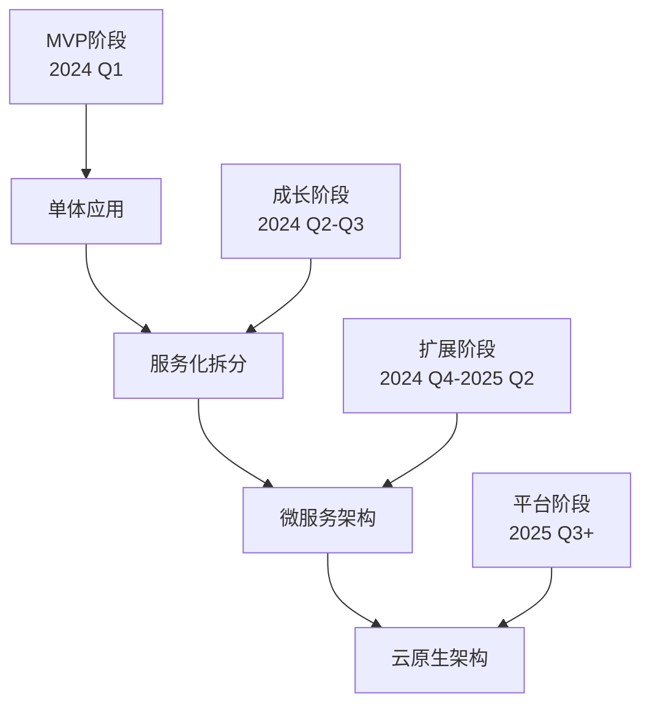

# MBTI测试产品总体执行路线图

## 1. 战略执行总览

### 1.1 三年发展愿景
**成为中国领先的MBTI专业测试和个人成长服务平台，帮助1000万用户实现自我认知和个人发展。**

### 1.2 分阶段目标设定

#### 第一年：立足（2024年）
```
【产品目标】
- 完成MVP开发和发布
- 建立核心功能体系
- 形成基础商业模式
- 打造专业品牌形象

【用户目标】
- 注册用户：100万
- 月活用户：30万
- 付费用户：4.5万
- 用户满意度：4.5+

【收入目标】
- 年收入：2000万元
- 付费转化率：15%
- 客单价：45元
- 月增长率：20%

【团队目标】
- 团队规模：20人
- 核心团队稳定率：90%+
- 技术团队占比：60%
- 人效：100万/人年
```

#### 第二年：发展（2025年）
```
【产品目标】
- 完善产品功能矩阵
- 建立开放平台生态
- 推出企业级服务
- 扩展产品线

【用户目标】
- 注册用户：300万
- 月活用户：100万
- 付费用户：15万
- 复购率：40%

【收入目标】
- 年收入：6000万元
- 多元化收入结构
- 企业客户占比：30%
- 利润率：25%

【团队目标】
- 团队规模：50人
- 建立地区分支
- 专业化分工
- 管理体系完善
```

#### 第三年：领先（2026年）
```
【产品目标】
- 成为行业标杆产品
- 建立技术护城河
- 形成生态闭环
- 考虑国际化扩展

【用户目标】
- 注册用户：1000万
- 月活用户：300万
- 付费用户：45万
- 品牌认知度：60%

【收入目标】
- 年收入：2亿元
- 多业务线发展
- 平台化收入
- 考虑IPO准备

【团队目标】
- 团队规模：100人
- 多地化布局
- 国际化团队
- 股权激励成熟
```

## 2. 产品发展路线图

### 2.1 产品功能发展时间线

#### 2024年Q1：MVP基础版
```
【核心功能】
✓ MBTI标准测试
✓ 基础结果解读
✓ 6大付费板块
✓ 分享传播功能
✓ 用户注册登录
✓ 支付购买系统

【技术架构】
✓ 基础技术架构
✓ 数据库设计
✓ API接口开发
✓ 前端应用开发
✓ 部署运维体系
✓ 监控日志系统

【运营功能】
✓ 用户管理后台
✓ 内容管理系统
✓ 数据统计分析
✓ 客服支持工具
✓ 营销活动工具
✓ 财务结算系统
```

#### 2024年Q2：用户体验增强版
```
【产品优化】
✓ 个性化推荐系统
✓ 用户画像分析
✓ 智能测试题目
✓ 社交互动功能
✓ 移动端体验优化
✓ 页面性能提升

【内容扩展】
✓ 内容深度优化
✓ 视频内容制作
✓ 专家解读音频
✓ 用户案例故事
✓ 行业应用指南
✓ 热点话题解读

【功能增强】
✓ 朋友关系分析
✓ 群体测试功能
✓ 测试历史管理
✓ 个人成长档案
✓ 消息通知系统
✓ 客服聊天功能
```

#### 2024年Q3：社交化平台版
```
【社交功能】
✓ 用户社群建设
✓ 话题讨论区
✓ 同类型用户匹配
✓ 内容点赞评论
✓ 用户动态分享
✓ 线上活动功能

【智能化升级】
✓ AI推荐算法
✓ 智能客服机器人
✓ 自动化营销
✓ 行为预测分析
✓ 内容智能生成
✓ 异常检测系统

【会员体系】
✓ 会员等级设计
✓ 积分奖励系统
✓ 专属权益服务
✓ VIP客服支持
✓ 会员专属内容
✓ 线下活动优先权
```

#### 2024年Q4：商业化成熟版
```
【变现优化】
✓ 多层次定价策略
✓ 订阅制服务
✓ 企业级产品
✓ 专家咨询服务
✓ 培训课程销售
✓ 广告变现模式

【平台化建设】
✓ API接口开放
✓ 第三方应用集成
✓ 开发者平台
✓ 合作伙伴体系
✓ 数据服务输出
✓ 技术解决方案
```

### 2.2 技术发展路线图

#### 架构演进规划


#### 技术能力建设时间表
```
【2024年Q1-Q2】基础技术建设
- 基础架构搭建完成
- 核心业务系统开发
- 数据存储和分析体系
- 基础运维监控体系
- 信息安全防护体系

【2024年Q3-Q4】智能化技术
- 机器学习算法应用
- 大数据分析平台
- 实时推荐系统
- 自然语言处理
- 图像识别技术

【2025年Q1-Q2】平台化技术
- 微服务架构改造
- 容器化部署体系
- API网关建设
- 服务治理平台
- 多租户架构

【2025年Q3-Q4】前沿技术探索
- AI大模型应用
- 区块链技术探索
- AR/VR体验技术
- 边缘计算应用
- 量子计算准备
```

## 3. 市场拓展路线图

### 3.1 用户增长路线图

#### 获客渠道发展时间表
```javascript
const acquisitionRoadmap = {
  '2024-Q1': {
    primary_channels: ['搜索引擎', '社交媒体'],
    investment: '100万元',
    target_users: '10万',
    cac_target: '10元'
  },
  
  '2024-Q2': {
    primary_channels: ['KOL合作', '内容营销', '付费广告'],
    investment: '300万元', 
    target_users: '30万',
    cac_target: '15元'
  },
  
  '2024-Q3': {
    primary_channels: ['病毒传播', '品牌营销', '线下活动'],
    investment: '500万元',
    target_users: '60万',
    cac_target: '12元'
  },
  
  '2024-Q4': {
    primary_channels: ['自然增长', '合作伙伴', '口碑传播'],
    investment: '400万元',
    target_users: '100万',
    cac_target: '8元'
  }
};
```

#### 用户生命周期价值提升
```
【第一阶段】基础价值建立
- 提升测试完成率：80% → 90%
- 提升付费转化率：10% → 15%
- 提升用户满意度：4.0 → 4.5
- 建立初步用户忠诚度

【第二阶段】深度价值挖掘
- 提升复购率：20% → 40%
- 提升客单价：30元 → 50元
- 提升推荐率：15% → 30%
- 建立用户社群价值

【第三阶段】生态价值实现
- 提升LTV：150元 → 300元
- 降低流失率：30% → 15%
- 提升NPS：30 → 60
- 建立品牌资产价值
```

### 3.2 业务扩展路线图

#### 产品线扩展计划
```
【2024年】垂直深化
- MBTI专业测试（核心产品）
- 职业规划测试
- 恋爱匹配测试
- 个人成长测试

【2025年】横向扩展
- 企业团队测试
- 教育机构服务
- 心理健康评估
- 能力素质测评

【2026年】生态建设
- 在线心理咨询
- 个人成长教练
- 职业培训课程
- 企业咨询服务
```

#### 地域扩展策略
```
【第一阶段】一线城市深耕
重点城市：北京、上海、广州、深圳
策略：高端用户获取，品牌影响力建设
投入：线下活动，KOL合作，精准广告

【第二阶段】二三线城市覆盖  
重点城市：杭州、南京、成都、武汉等15个城市
策略：规模化用户获取，本地化内容
投入：本地化运营团队，区域合作伙伴

【第三阶段】下沉市场渗透
重点区域：县级市和发达乡镇
策略：简化产品，降低门槛，社交传播
投入：轻量化产品，社交营销，口碑传播
```

## 4. 商业化路线图

### 4.1 收入结构演进

#### 收入模式发展时间表
```
【2024年】单一付费模式
- 测试付费：80%收入占比
- 会员订阅：15%收入占比  
- 其他服务：5%收入占比
- 目标收入：2000万元

【2025年】多元化收入模式
- 个人付费：50%收入占比
- 企业服务：30%收入占比
- 平台佣金：15%收入占比
- 广告收入：5%收入占比
- 目标收入：6000万元

【2026年】生态化收入模式
- 平台交易：40%收入占比
- 企业服务：30%收入占比
- 个人订阅：20%收入占比
- 数据服务：10%收入占比
- 目标收入：2亿元
```

#### 定价策略演进
```sql
-- 定价策略发展历程
WITH pricing_evolution AS (
  SELECT 
    '2024-Q1' as period,
    29.9 as basic_price,
    NULL as premium_price,
    NULL as enterprise_price,
    '单一定价' as strategy
  
  UNION ALL
  
  SELECT 
    '2024-Q2' as period,
    29.9 as basic_price,
    59.9 as premium_price, 
    NULL as enterprise_price,
    '分层定价' as strategy
    
  UNION ALL
  
  SELECT
    '2024-Q3' as period,
    19.9 as basic_price,
    49.9 as premium_price,
    199 as enterprise_price,
    '多层定价' as strategy
    
  UNION ALL
  
  SELECT
    '2024-Q4' as period,
    19.9 as basic_price,
    39.9 as premium_price,
    299 as enterprise_price,
    '订阅制+单次付费' as strategy
)
SELECT * FROM pricing_evolution;
```

### 4.2 盈利能力建设

#### 成本结构优化
```
【2024年成本结构】
- 人力成本：60%（1200万）
- 营销成本：25%（500万）
- 技术成本：10%（200万）
- 运营成本：5%（100万）
- 总成本：2000万元
- 盈亏平衡点

【2025年成本结构】
- 人力成本：50%（3000万）
- 营销成本：30%（1800万）
- 技术成本：15%（900万）
- 运营成本：5%（300万）
- 总成本：6000万元
- 净利润率：0%

【2026年成本结构】
- 人力成本：40%（8000万）
- 营销成本：25%（5000万）
- 技术成本：20%（4000万）
- 运营成本：15%（3000万）
- 总成本：2亿元
- 净利润率：15%
```

#### 单位经济模型优化
```javascript
// 单位经济模型演进
const unitEconomics = {
  '2024': {
    cac: 15,           // 获客成本
    ltv: 120,          // 用户生命周期价值
    ltv_cac_ratio: 8,  // LTV/CAC比值
    payback_period: 4,  // 回本周期(月)
    gross_margin: 0.7   // 毛利率
  },
  
  '2025': {
    cac: 12,
    ltv: 200,
    ltv_cac_ratio: 16.7,
    payback_period: 2.5,
    gross_margin: 0.75
  },
  
  '2026': {
    cac: 8,
    ltv: 350,
    ltv_cac_ratio: 43.8,
    payback_period: 1.5,
    gross_margin: 0.8
  }
};
```

## 5. 团队建设路线图

### 5.1 组织发展规划

#### 团队规模发展时间表
```
【2024年Q1】创业团队（12人）
├── 管理层（3人）：CEO、CTO、COO
├── 产品团队（3人）：产品经理、设计师、用研
├── 技术团队（4人）：前端、后端、测试、运维
└── 运营团队（2人）：运营、内容

【2024年Q4】成长团队（20人）
├── 管理层（4人）：增加CPO
├── 产品团队（5人）：扩充设计和产品
├── 技术团队（8人）：前后端各增加，增加算法
└── 运营团队（3人）：增加数据分析

【2025年Q4】专业团队（50人）
├── 管理层（8人）：完整C-level团队
├── 产品团队（12人）：多条产品线
├── 技术团队（20人）：微服务架构团队
├── 运营团队（8人）：专业化运营团队
└── 支持团队（2人）：财务、法务、HR

【2026年Q4】企业团队（100人）
├── 管理层（15人）：中层管理完善
├── 产品团队（25人）：多产品线矩阵
├── 技术团队（35人）：平台化技术团队
├── 运营团队（15人）：精细化运营团队
└── 支持团队（10人）：完整职能团队
```

#### 核心岗位发展规划
```
【技术团队发展】
2024: 全栈工程师 → 专业分工
2025: 专业团队 → 技术专家
2026: 专家团队 → 技术领袖

【产品团队发展】
2024: 产品经理 → 产品专家
2025: 产品专家 → 产品总监
2026: 产品总监 → 产品VP

【运营团队发展】
2024: 运营专员 → 运营经理
2025: 运营经理 → 运营总监
2026: 运营总监 → 运营VP
```

### 5.2 企业文化建设

#### 价值观体系建设
```
【核心价值观】
- 用户第一：始终以用户价值为中心
- 专业精神：追求专业性和科学性
- 创新驱动：持续创新和改进
- 团队协作：开放包容的团队文化
- 长期主义：关注长期价值创造

【文化建设里程碑】
2024-Q1: 价值观确立和宣贯
2024-Q2: 文化制度建设完善
2024-Q3: 文化活动常态化
2024-Q4: 文化考核体系建立
2025: 文化品牌对外输出
2026: 文化影响力行业领先
```

#### 人才发展体系
```
【人才梯队建设】
- 应届生培养计划：校园招聘+导师制
- 骨干员工发展：内部晋升+外部培训  
- 管理人才培养：领导力训练+轮岗锻炼
- 专家人才引进：行业专家+股权激励

【激励机制完善】
2024: 基础薪酬+年终奖
2025: 股权激励+长期激励
2026: 合伙人制+事业部制
```

## 6. 风险应对路线图

### 6.1 风险识别时间表

#### 不同阶段主要风险
```
【2024年风险】
- 产品开发风险：技术实现难度
- 市场竞争风险：巨头入场威胁  
- 团队风险：核心人员流失
- 资金风险：现金流紧张

【2025年风险】
- 规模化风险：系统承载能力
- 合规风险：监管政策变化
- 组织风险：管理能力跟不上
- 战略风险：业务方向偏差

【2026年风险】
- 创新风险：技术迭代落后
- 市场风险：用户需求变化
- 竞争风险：新进入者威胁
- 系统性风险：经济环境变化
```

#### 风险预警机制
```javascript
// 风险监控预警系统
const riskMonitoring = {
  product_risks: {
    tech_debt: {
      metric: 'code_complexity_score',
      threshold: 7.0,
      frequency: 'weekly',
      owner: 'CTO'
    },
    user_satisfaction: {
      metric: 'app_store_rating',
      threshold: 4.0,
      frequency: 'daily',
      owner: 'CPO'
    }
  },
  
  business_risks: {
    cash_flow: {
      metric: 'monthly_burn_rate',
      threshold: '6_month_runway',
      frequency: 'weekly',
      owner: 'CFO'
    },
    competition: {
      metric: 'market_share_change',
      threshold: '-10%',
      frequency: 'monthly',
      owner: 'CEO'
    }
  },
  
  team_risks: {
    turnover_rate: {
      metric: 'quarterly_turnover',
      threshold: '15%',
      frequency: 'monthly', 
      owner: 'CHO'
    },
    productivity: {
      metric: 'story_points_per_sprint',
      threshold: '-20%',
      frequency: 'bi_weekly',
      owner: 'CTO'
    }
  }
};
```

### 6.2 应对策略路线图

#### 风险缓解措施
```
【技术风险应对】
- 技术选型保守：选择成熟技术栈
- 架构设计冗余：预留扩展空间
- 代码质量管控：持续集成/持续部署
- 知识文档化：减少关键人员依赖

【市场风险应对】
- 多元化策略：不依赖单一渠道
- 用户粘性建设：提高转换成本
- 品牌建设投入：建立护城河
- 合作伙伴网络：降低竞争风险

【团队风险应对】
- 股权激励计划：长期利益绑定
- 文化建设投入：提高归属感
- 人才梯队建设：避免单点故障
- 外部人才引进：持续补充新血液
```

## 7. 融资发展路线图

### 7.1 融资需求规划

#### 融资时间表
```
【Pre-A轮】2024年Q1
- 融资金额：500万元
- 出让股份：15%
- 投资方向：天使投资人/早期基金
- 资金用途：产品开发40%，团队建设40%，市场推广20%

【A轮】2024年Q4  
- 融资金额：2000万元
- 出让股份：20%
- 投资方向：知名VC基金
- 资金用途：市场推广50%，团队扩张30%，技术研发20%

【B轮】2025年Q3
- 融资金额：5000万元
- 出让股份：15%
- 投资方向：战略投资者/大型基金
- 资金用途：业务扩张40%，技术平台30%，渠道建设30%

【C轮】2026年Q2
- 融资金额：1亿元
- 出让股份：10%
- 投资方向：PE基金/战略投资
- 资金用途：市场扩张50%，国际化25%，收购整合25%
```

#### 投资人匹配策略
```
【Pre-A轮目标投资人】
- 真格基金：教育/工具类项目经验
- 险峰长青：消费互联网关注度
- 梅花创投：早期项目投资活跃
- 个人天使：行业专家和成功创业者

【A轮目标投资人】
- 经纬中国：消费互联网专业投资
- 红杉中国：综合实力强劲
- IDG资本：技术驱动项目偏好
- 启明创投：企业服务方向布局

【B轮目标投资人】
- 腾讯投资：生态协同效应
- 阿里巴巴：电商生态整合
- 字节跳动：内容流量协同
- 美团：本地生活服务整合

【C轮及以后】
- 高瓴资本：长期价值投资
- 软银中国：国际化视野
- KKR：私募股权投资
- 华平投资：成长期投资专家
```

### 7.2 估值发展预期

#### 估值模型演进
```python
# 估值计算模型
def calculate_valuation(stage, revenue, growth_rate, market_multiple):
    """
    计算公司估值
    stage: 融资阶段
    revenue: 年收入
    growth_rate: 增长率
    market_multiple: 市场倍数
    """
    
    base_valuation = revenue * market_multiple
    growth_premium = base_valuation * (growth_rate / 100) * 0.5
    
    stage_multiplier = {
        'Pre-A': 0.8,
        'A': 1.0,
        'B': 1.2,
        'C': 1.5
    }
    
    final_valuation = (base_valuation + growth_premium) * stage_multiplier[stage]
    return final_valuation

# 各轮估值预期
valuations = {
    'Pre-A': {
        'revenue': 0,  # 未产生收入
        'growth_rate': 0,
        'market_multiple': 0,
        'valuation': 3000  # 万元
    },
    'A': {
        'revenue': 2000,  # 万元
        'growth_rate': 300,
        'market_multiple': 8,
        'valuation': 10000  # 万元
    },
    'B': {
        'revenue': 6000,
        'growth_rate': 200,
        'market_multiple': 10,
        'valuation': 30000
    },
    'C': {
        'revenue': 20000,
        'growth_rate': 150,
        'market_multiple': 12,
        'valuation': 100000
    }
}
```

## 8. 退出策略规划

### 8.1 退出路径选择

#### 主要退出方式评估
```
【IPO上市】
时间窗口：2027-2028年
条件要求：
- 年收入5亿元以上
- 净利润1亿元以上
- 市场地位行业前2
- 规范治理结构完善

【战略收购】
时间窗口：2025-2027年
潜在买家：
- 腾讯：社交生态整合
- 字节跳动：内容算法协同
- 阿里巴巴：钉钉企业服务
- 网易：教育产品矩阵

【管理层收购（MBO）】
时间窗口：2026年后
条件要求：
- 管理团队资金实力
- 外部财务投资者支持
- 公司治理结构调整
- 股东退出意愿
```

#### 退出价值最大化策略
```
【财务表现优化】
- 收入规模：追求规模化增长
- 盈利能力：提升利润率水平
- 增长质量：关注可持续增长
- 现金流：保持健康现金流

【战略价值提升】
- 市场地位：建立行业领导地位
- 技术壁垒：构建核心技术护城河
- 用户资产：积累高价值用户群体
- 品牌价值：建立强势品牌影响力

【治理结构完善】
- 董事会结构：独立董事机制
- 财务规范：规范财务管理体系
- 内控制度：完善内部控制体系
- 合规经营：确保合规经营状态
```

## 9. 成功关键要素

### 9.1 关键成功因素

#### 产品成功要素
```
【用户体验】(权重：30%)
- 测试体验流畅度
- 结果解读专业性
- 界面设计美观度
- 功能使用便捷性

【内容质量】(权重：25%)
- 专业性和准确性
- 个性化程度
- 实用性和指导性
- 更新频率和深度

【技术能力】(权重：20%)
- 系统稳定性
- 性能响应速度
- 数据安全保障
- 算法精准度

【商业模式】(权重：15%)
- 变现能力
- 用户付费意愿
- 客单价水平
- 复购率表现

【品牌影响力】(权重：10%)
- 用户认知度
- 口碑传播度
- 专业权威性
- 社会影响力
```

#### 团队成功要素
```
【核心团队能力】
- 创始人领导力和vision
- 产品团队的用户洞察能力
- 技术团队的执行能力
- 运营团队的增长能力

【组织发展能力】
- 快速学习和适应能力
- 跨部门协作效率
- 创新和试错文化
- 人才吸引和保留能力

【执行力】
- 目标设定和分解能力
- 项目管理和进度控制
- 问题识别和解决能力
- 资源整合和利用效率
```

### 9.2 风险控制要点

#### 核心风险点控制
```
【产品风险】
- 定期用户调研，及时调整产品方向
- 持续技术投入，保持技术领先性
- 建立质量管控体系，确保产品质量
- 关注竞品动态，保持差异化优势

【市场风险】
- 多元化获客渠道，降低渠道依赖
- 建立用户粘性，提高转换成本
- 持续品牌建设，增强用户忠诚度
- 关注政策变化，确保合规经营

【团队风险】
- 建立股权激励机制，绑定核心人员
- 完善人才梯队建设，避免关键人员依赖
- 营造良好企业文化，提高团队凝聚力
- 建立知识管理体系，降低人员流失影响

【财务风险】
- 建立财务预警机制，确保现金流安全
- 多元化收入来源，降低单一业务风险
- 控制成本结构，提高运营效率
- 适时融资规划，保证发展资金需求
```

## 10. 执行保障机制

### 10.1 目标管理体系

#### OKR目标管理
```javascript
// 公司级OKR示例
const companyOKR = {
  objective: "成为MBTI领域领先平台",
  keyResults: [
    {
      description: "注册用户达到100万",
      measure: "用户数量",
      target: 1000000,
      current: 0,
      progress: 0
    },
    {
      description: "年收入达到2000万元", 
      measure: "收入金额",
      target: 20000000,
      current: 0,
      progress: 0
    },
    {
      description: "用户满意度超过4.5分",
      measure: "满意度评分",
      target: 4.5,
      current: 0,
      progress: 0
    }
  ]
};

// 部门级OKR级联
const departmentOKRs = {
  product: {
    objective: "打造极致用户体验",
    keyResults: ["测试完成率90%", "结果页停留时长5分钟", "分享率25%"]
  },
  technology: {
    objective: "建设稳定高效技术平台", 
    keyResults: ["系统可用性99.9%", "API响应时间<500ms", "零安全事故"]
  },
  operations: {
    objective: "实现高效用户增长",
    keyResults: ["获客成本<15元", "付费转化率15%", "月增长率20%"]
  }
};
```

#### 绩效考核体系
```
【个人绩效评估】
季度考核：
- 目标达成度（40%）
- 工作质量（30%）
- 团队协作（20%）
- 创新贡献（10%）

年度考核：
- 年度目标达成（50%）
- 能力提升（25%）
- 文化贡献（15%）
- 360度评价（10%）

【团队绩效评估】
部门绩效：
- 部门OKR达成度
- 跨部门协作效果
- 团队发展和培养
- 创新项目贡献

公司绩效：
- 整体战略目标达成
- 财务指标完成情况
- 市场地位和影响力
- 可持续发展能力
```

### 10.2 监控预警体系

#### 实时监控看板
```sql
-- 核心指标监控查询
CREATE VIEW executive_dashboard AS
SELECT 
    DATE(current_date) as date,
    
    -- 用户指标
    (SELECT COUNT(*) FROM users WHERE created_at::date = current_date) as daily_new_users,
    (SELECT COUNT(*) FROM user_sessions WHERE created_at::date = current_date) as daily_active_users,
    
    -- 业务指标  
    (SELECT COUNT(*) FROM tests WHERE completed_at::date = current_date) as daily_completed_tests,
    (SELECT SUM(amount) FROM payments WHERE created_at::date = current_date AND status = 'success') as daily_revenue,
    
    -- 技术指标
    (SELECT AVG(response_time) FROM api_logs WHERE created_at::date = current_date) as avg_api_response_time,
    (SELECT COUNT(*) FROM error_logs WHERE created_at::date = current_date) as daily_error_count,
    
    -- 运营指标
    (SELECT COUNT(*) FROM shares WHERE created_at::date = current_date) as daily_shares,
    (SELECT AVG(rating) FROM user_feedbacks WHERE created_at::date = current_date) as avg_user_rating;
```

#### 预警触发机制
```javascript
// 预警规则配置
const alertRules = {
  user_growth: {
    metric: 'daily_new_users',
    condition: 'below_target',
    threshold: 0.8, // 低于目标80%
    recipients: ['CEO', 'COO', '运营团队'],
    severity: 'medium'
  },
  
  revenue_decline: {
    metric: 'daily_revenue',
    condition: 'week_over_week_decline',
    threshold: 0.2, // 周环比下降20%
    recipients: ['CEO', 'CFO', '销售团队'],
    severity: 'high'
  },
  
  system_failure: {
    metric: 'system_availability',
    condition: 'below_threshold',
    threshold: 0.99, // 可用性低于99%
    recipients: ['CTO', '技术团队', 'CEO'],
    severity: 'critical'
  }
};
```

通过以上全面的执行路线图，我们为MBTI测试产品的成功实施提供了清晰的指导方针和具体的执行计划。关键在于严格按照路线图执行，同时保持足够的灵活性来应对市场变化和机遇挑战。